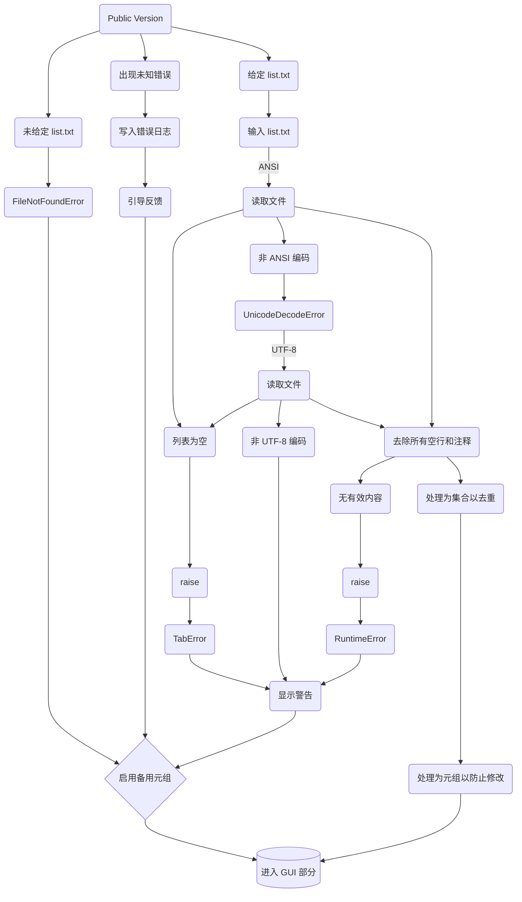

```mermaid
graph TD

%% 未给定 list.txt，自动启用备用元组
a(Public Version)-->b1(未给定 list.txt)
b1-->e1(FileNotFoundError)
e1------------>f1{启用备用元组}
f1-->f2[(进入 GUI 部分)]

%% 未知错误
a-->b3(出现未知错误)
b3-->e4(写入错误日志)
e4-->f6(引导反馈)
f6----------->f1

%% 给定 list.txt
a-->b2(给定 list.txt)
b2-->c(输入 list.txt)
c--ANSI-->d1(读取文件)

%% 列表为空
d1-->g1(列表为空)
g1---->e(raise)
e-->e2(TabError)
e2-->f5("显示警告")
f5-->f1

%% 非 ANSI 编码
d1-->g2(非 ANSI 编码)
g2-->e3(UnicodeDecodeError)
e3--UTF-8-->d2(读取文件)

%% UTF-8编码
d2-->h1

%% 列表为空
d2-->g1

%% 非 UTF-8 编码
d2-->g3(非 UTF-8 编码)
g3------>f5

%% ANSI 编码
d1-->h1(去除所有空行和注释)
h1-->g4(无有效内容)--->e'(raise)-->e5(RuntimeError)-->f5
h1-->f3(处理为集合以去重)
f3------>f4(处理为元组以防止修改)
f4-->f2
```
